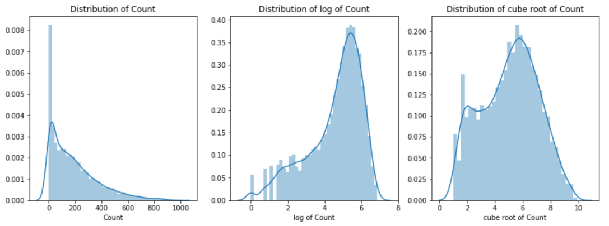
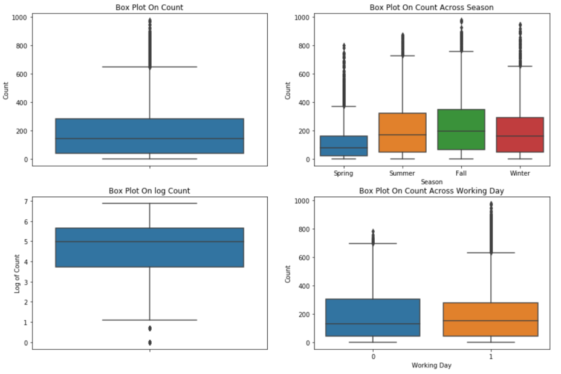

# Bike Sharing Demand

Bike Sharing Demand is a Kaggle competition, in which we need to forecast bike rental demand by analyzing and combining historical usage patterns with weather and season data. According to Kaggle competition, “Bike sharing systems are a means of renting bicycles where the process of obtaining membership, rental, and bike return is automated via a network of kiosk locations throughout a city. Using these systems, people are able rent a bike from a one location and return it to a different place on an as-needed basis. Currently, there are over 500 bike-sharing programs around the world.”

Bike sharing services consists of a large number of bikes located at multiple locations in a city. Riders can rent these bikes from docking stations and can return to a docking station after usage. Due to a large number of daily renters and dynamic nature of bike demand, it is very important to forecast hourly bike demand to maintain the sufficient amount bikes at a station. It will also help in designing and expanding the bike share service.

However, bike demands are very dynamic in nature and depend hugely on external factors like weather, holidays, and office timings. So, in the competition, we need to design n machine learning algorithm that can accurately predict the demand of bikes at a particular hour on a particular day. According to the rules, the machine learning algorithm can only use information which was available prior to the time for which it is forecasting. For this competition, Kaggle given us the dataset provided by Hadi Fanaee Tork using data from Capital Bikeshare. Captial Bikeshare is bike share service in Washington DC. They also provide real-time trip history data to developers, statisticians, and other interested members for analysis, development, and visualization.

## Objective

The objective of my project is to train a model on a challenging mid to large-scale dataset that can predict the number of rented bikes on a day at a particular time. Based problem statement, I understand that it is regression problem on a time series data. Based on my preliminary analysis, regression algorithms like support vector regression, random forest regression, and boosting techniques can be used to forecast the count of rented bikes.

### Data Description

As mentioned earlier, the dataset is created using the data provided by from ‘Captial Bikeshare’ by Hadi Fanaee [2]. The dataset is hosted at UCI machine learning repository. The dataset contains hourly and daily count of rental bikes between the year 2011 and 2012 in Captial Bikeshare system with corresponding weather and seasonal information. The dataset has 17389 number of rows (i.e., number of instances), and has 12 attributes (features). The training dataset comprises of 10887 entries and 12 attributes. The test dataset comprises of 6494 entries and 9 attributes. The training dataset comprises of first 19 days of each month while the test dataset comprises entries from 20th day to the end of the month. As per the rules, we must predict the total count of bikes to be rented during each hour covered by the test dataset, by only using information available to the rental period.

The train dataset has the following attributes:
1. Datetime: Datetime attribute contains the hourly date and timestamp information of each entry in the data set. The values of this attributes are of format: “dd-mm-yyyy hh:mm:ss”
2. Season: This attribute contains the season information in a year i.e., 1 = Spring, 2 = Summer, 3 = Fall, 4 = Winter.
3. Holiday: This attribute contains information about if the day is considered a holiday or not. This attribute has binary values (0: not holiday, 1: holiday)
4. Workingday: This attribute contains information about if the day is neither a holiday nor a weekend. This attribute has binary values (0: not working day, 1: working day).
5. Weather: It contains information about the weather conditions.
6. Temp: Contains temperature information in Celsius. The values are normalized temperature in Celsius. The values are derived via (t-t_min)/(t_max-t_min), t_min = -8, t_max = +39 (only in hourly scale)
7. Atemp: Contains “feels like” temperature values in Celsius. Normalized feeling temperature in Celsius. The values are derived via (t-t_min)/(t_max-t_min), t_min=-16, t_max=+50 (only in hourly scale)
8. Humidity: Contains normalized relative humidity values. The values are divided by 100 (max).
9. Windspeed: Contains normalized windspeeds. The values are divided by 67 (max)
10. Casual (Dependent Variable): Contains the count of non-registered user rentals initiated.
11. Registered (Dependent Variable): Contains the count of registered user rentals initiated.
12. Count (Dependent Variable): Contains the count of total number of user rentals initiated (casual + registered).

Since, we have good idea of the dataset attributes and its independent and dependent variables, we can start exploring the dataset further. For this, we will try to identify individual and combined relationship between the dependent variables and dependent variables. From the above description of the dataset, we can understand that attributes ‘casual’, ‘registered’, and ‘count’ are the dependent attributes while all other are independent attributes. By analyzing the values of ‘casual’ and ‘registered’ we came to know that attribute ‘count’ is just the sum of two attributes. So, we would have to consider these three attributes as dependent variables.

## Exploratory Data Analysis and Feature Engineering
Now, I would try to identify important patterns and would try to extract insights from the dataset so that we can better understand the role and significance of each attribute and its effect on the dependent variables. Before starting the data analysis, lets have a quick look at how our dataset is arranged. For convenience, I have merged the training and test datasets so that each transformation on every attribute is applied to training and test datasets equivalently.

### Extracting Important Information from ‘Datetime’ Column

As we can observe from the first 5 rows of our dataset that the ‘datetime’ column has a lot of information that we could exploit. So, as a first step, we would split the ‘datetime’ and extract information like date, hour, month, and weekday (name of the day of a week e.g., Saturday).

By splitting the ‘datetime’ column we could extract the following new columns:

1. Hour: This column represents the hours on a particular date. The value of this variable varies from 0 – 23. Based on its nature, we can say that this variable is categorical and cyclic in nature since, ‘0’ and ‘23’ are closely related i.e., 12:00am and 11:00pm. So, we would either consider it as a categorical feature or will apply ‘sine’ and ‘cosine’ transformations such that our machine learning algorithm takes this attribute as a cyclic attribute.
2. Month: This column contains the name of the month on which the entry was registered e.g., 1: January, 2: February, etc. This is also a categorical variable.
3. Weekday: This column contains the name of day e.g., Saturday, Sunday, etc. This is a categorical variable.
4. Year: This column contains the year in which the entry was registered. 
 
### Summary of Columns and Checking for Missing and Null Values in the dataset

Now that we have split the ‘datetime’ columns, we will have to check if there are any missing or null values in the dataset. Along with it, we can also, quickly analyze first, last, maximum, and minimum values of each column and their entropy.

Based on the table below, we can observe that there are no missing values in this dataset. However, there are couple of more interesting insights that we can extract from this. These points are mentioned below:

1. There are no missing values in this dataset. However, column ‘windspeed’ as a lot of values as ‘0’. This is unusual since, it is very rare when we have zero windspeed.
2. The following variables has a limited ‘unique values’ and hence they should be considered as categorical: season, holiday, workingday, weather, hour, month, weekday, day, year.
3. There are no negative values in the dataset i.e., there are no false entries in the dataset.

### Predicting Zero Values of ‘windspeed’
As we know that there are zero values in windspeed, we can use Random Forest Regressor with default values to predict these zero values and then replace zero values with them. To predict the values, we would use the attribute that can directly affect the values of windspeed. Hence, we would use the following attributes: "season", "holiday", "workingday", "weather", "weekday", "month", "year", "hour".
We would use the following hyperparameters for our random forest regressors: n_estimators=1200, max_depth=180, max_features='auto'.

### Analysis of Outliers and Skewness in the column ‘count’
After predicting the values in windspeed, we should now check if there are any outliers in the ‘count’ dependent variable. Also, we would check the distribution of the ‘count’ variable.

Figure a. Distribution of Count variable, b. Distribution of Log transformed Count variable, c. Distribution of Cube root transformed Count variable

The above fig. 1 (a) shows that the dependent variable ‘count’ is highly right skewed i.e., there are a lot of values on the right side of the curve making a tail on the right side. Skewness is an important issue that we need to address as this can make our algorithm make wrong predictions. To deal with the right skewed data we can apply the following transformations:
1. Log Transformation
2. Cube Root Transformation

As we can see, in the fig. 1 (a) and (b), that taking a log transformation improves the distribution of variable, but there is still skewness in the data, meanwhile, the cube root transformation greatly reduce the skewness in the data. However, during modelling, we got better results with log transformation of ‘count’ rather than cube root transformation of ‘count’. Hence, we dropped the cube root transformation root.

Now, we would analyze the outliers in the dependent variable ‘count’. To do that, we would plot the boxplots of count vs different independent variables. As we can see in the plots below that there are outliers in the ‘count’ variable. Also, we can observe following points from the plots below:
1. There are outliers in the variable ‘count’. However, the effect of outliers is greatly reduced when we apply log transformation on ‘count’.
2. The season ‘Spring’ has a smaller number of counts since there is a significant dip in the median. So, we can make a hypothesis that ‘temperature’ would play an important role in forecasting ‘count’ since, in spring outside temperature would not be favorable for bike renting and riders would prefer other modes of transport.
3. There are more outliers on a working day. From this we can conclude that these outliers are due to high demand of bikes on a working day and are not entered in the data erroneously. Hence, we would not remove these outliers as removing them will lead to more information loss. We would use log transformation to reduce the effect of these outliers.

